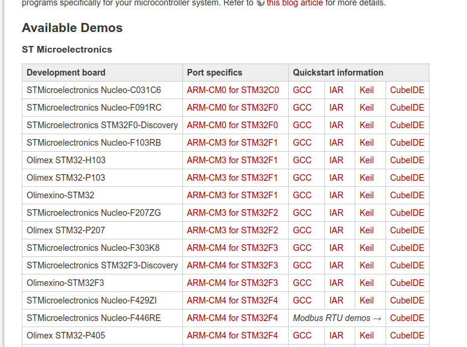
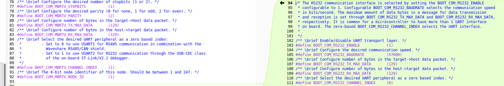
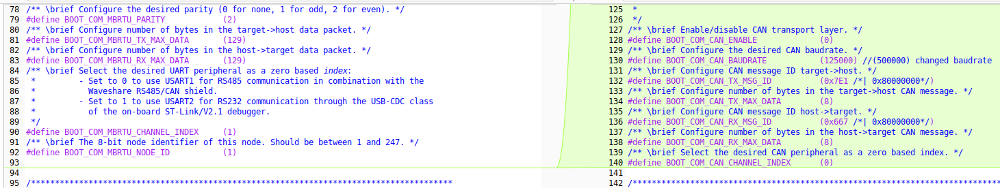
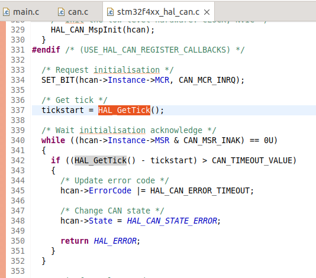

---

title: OpenBLT in Nucleo-F446RE
permalink: /projects/en/open-blt
key: openblt-mig
---

# Before Start
As we notice in last [post](https://razielgdn.github.io/risingembeddedmx/projects/en/openblt-start) only Modbus is available in the demo.   

To **activate** RS232 and CAN bus as flash sources in **OpenBLT**, you need to enable the necessary resources such as **GPIOs**, **clock sources**, and their respective **drivers**. The following steps document the process of performing this task using the OpenBLT demo as a base and modifying it to enable the mentioned resources.

# Enabling USARTx and CAN GPIOs
MBRTU and RS232 use the USART1 and USART2 resources to work. To enable the use of RS232 and CAN ports, the following changes were made to the code:

First of all the Macros to manage RS232 and CAN were added to **blt_conf.h** file.   
- RS232 macros.    
     
- CAN macros.   
    
These lines were taken from another project that has support for both CAN and RS232.   

Studing the code I noticed that the parameters for USART1 & USART2 were initialized both in the main.c file and again in the rs232.c or mbrtu.c files. only the gpios and clock need to be enabled.

The **main.c** file has been updated to improve this implementation. Since a function to enable **GPIOs** was previously declared, the code to enable port communication has been moved there. This utilizes macros from **blt_conf.h** to optimize resources using conditionals to enable code sections.   
   
   

After enable the GPIOs and clocks you should check if the initialization is corrected. In a first momment the system didn't work, with a debugging session I notice that function **HAL_GetTick()**.   
      
The function was declared in two files **timer.c** and **stm32f4xx_hal.c** the solution was renamed the function in timer.c to **HAL_GetTick_openblt()**.   
   

